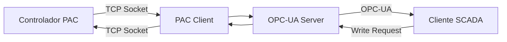

- Repositorio con solo archivos fuente necesarios"# PAC to OPC-UA Server


Un servidor OPC-UA bidireccional que actúa como gateway entre controladores PAC (Process Automation Controller) y clientes OPC-UA, desarrollado para el sistema SCADA de PetroSantander.

## 📋 Descripción

Este servidor permite:
- **Lectura en tiempo real** de variables desde controladores PAC hacia clientes OPC-UA
- **Escritura bidireccional** desde clientes OPC-UA hacia el controlador PAC
- **Organización jerárquica** de variables por TAG en el espacio de nombres OPC-UA
- **Soporte completo** para variables simples y de tabla (TBL_*)
- **Detección automática** de variables escribibles
- **Reconexión automática** al controlador PAC

## 🚀 Características Principales

### ✅ Comunicación Bidireccional
- 📖 **Lectura**: Variables del PAC → Clientes OPC-UA
- 📝 **Escritura**: Clientes OPC-UA → Variables del PAC
- 🔄 **Tiempo real**: Actualización configurable (default: 2 segundos)
- 🛡️ **Detección inteligente**: Distingue escrituras internas vs. externas

### ✅ Tipos de Variables Soportadas
- **Variables Simples**: Valores individuales del PAC
- **Variables de Tabla**: Arrays indexados (TBL_TT_, TBL_PT_, TBL_LT_, etc.)
- **Variables API**: Parámetros de control API
- **Variables Batch**: Datos de proceso por lotes
- **Variables de Alarma**: Estados de alarmas (TBL_TA_, TBL_PA_, etc.)

### ✅ Variables Escribibles Automáticas
- `SetHH`, `SetH`, `SetL`, `SetLL` (Límites de alarma)
- `SIM_Value` (Valores de simulación)
- `SP` (SetPoint PID)
- `CV` (Control Value PID)
- `Kp`, `Ki`, `Kd` (Parámetros PID)
- `auto_manual` (Modo automático/manual)
- `CPL`, `CTL` (Variables API)

### ✅ Tipos de Datos
- **FLOAT**: Variables analógicas (temperaturas, presiones, niveles)
- **INT32**: Variables digitales y estados

## 🛠️ Tecnologías

- **Lenguaje**: C++17
- **OPC-UA**: open62541 library
- **Comunicación PAC**: Socket TCP
- **Configuración**: JSON
- **Build System**: CMake
- **Logging**: Sistema personalizado con colores

## 📁 Estructura del Proyecto

```
pac_to_opcua/
├── src/                          # Código fuente
│   ├── main.cpp                 # Punto de entrada
│   ├── opcua_server.cpp         # Servidor OPC-UA principal
│   └── pac_control_client.cpp   # Cliente para comunicación PAC
├── include/                      # Headers
│   ├── common.h                 # Estructuras y configuración global
│   ├── opcua_server.h           # Definiciones del servidor
│   └── pac_control_client.h     # Definiciones del cliente PAC
├── tags.json                    # Configuración de variables
├── CMakeLists.txt              # Configuración de build
├── .gitignore                  # Archivos ignorados por Git
├── production.sh               # Script de producción
├── README.md                   # Este archivo
└── DEPLOYMENT.md               # Guía de despliegue
```

## 🔧 Instalación

### Prerequisitos

```bash
# Ubuntu/Debian
sudo apt update
sudo apt install build-essential cmake git
sudo apt install libopen62541-dev nlohmann-json3-dev

# CentOS/RHEL
sudo yum groupinstall "Development Tools"
sudo yum install cmake git open62541-devel nlohmann-json-devel
```

### Compilación

```bash
# Clonar repositorio
git clone https://github.com/tu-usuario/pac_to_opcua.git
cd pac_to_opcua

# Compilar
mkdir build
cd build
cmake ..
make

# O usar Makefile directo
make clean
make
```

## ⚙️ Configuración

### Archivo `tags.json`

Define la estructura de variables que el servidor expondrá:

```json
{
  "pac_ip": "192.168.1.30",
  "pac_port": 22001,
  "opcua_port": 4840,
  "update_interval_ms": 2000,
  "server_name": "PAC Control SCADA Server",
  
  "TBL_tags": [
    {
      "name": "TT_11001",
      "value_table": "TBL_TT_11001",
      "alarm_table": "TBL_TA_11001",
      "variables": ["PV", "SV", "SetHH", "SetH", "SetL", "SetLL"],
      "alarms": ["HI", "LO", "HIHI", "LOLO", "BAD"]
    }
  ],
  
  "TBL_tags_api": [
    {
      "name": "API_11001",
      "value_table": "TBL_API_11001", 
      "variables": ["IV", "CPL", "CTL", "API"]
    }
  ],
  
  "BATCH_tags": [
    {
      "name": "BATCH_001",
      "value_table": "TBL_BATCH_001",
      "variables": ["Phase", "Step", "Progress", "Status"]
    }
  ]
}
```

### Parámetros de Configuración

| Parámetro | Descripción | Default |
|-----------|-------------|---------|
| `pac_ip` | Dirección IP del controlador PAC | `192.168.1.30` |
| `pac_port` | Puerto TCP del PAC | `22001` |
| `opcua_port` | Puerto del servidor OPC-UA | `4840` |
| `update_interval_ms` | Intervalo de actualización (ms) | `2000` |
| `server_name` | Nombre del servidor OPC-UA | `PAC Control SCADA Server` |

## 🚀 Uso

### Ejecución Básica

```bash
# Ejecutar servidor
./pac_to_opcua

# Con logs detallados
VERBOSE_DEBUG=1 ./pac_to_opcua

# Modo silencioso
SILENT_MODE=1 ./pac_to_opcua
```

### Script de Producción

```bash
# Usar script de producción
./production.sh

# El script incluye:
# - Verificación de dependencias
# - Compilación optimizada
# - Ejecución con manejo de errores
# - Logging a archivo
```

### Conexión de Clientes

```
Endpoint OPC-UA: opc.tcp://localhost:4840
Security: None (configurable)
```

**Clientes Recomendados:**
- UAExpert (Unified Automation)
- OPC Expert (Matrikon)
- Prosys OPC Client
- Cualquier cliente OPC-UA estándar

## 📊 Estructura de Variables OPC-UA

El servidor organiza las variables en una estructura jerárquica:

```
Root/
├── TT_11001/                    # TAG de Temperatura
│   ├── PV                      # Valor del proceso (FLOAT, read-only)
│   ├── SV                      # Valor simulado (FLOAT, read-only)
│   ├── SetHH                   # Límite alto-alto (FLOAT, writable)
│   ├── SetH                    # Límite alto (FLOAT, writable)
│   ├── SetL                    # Límite bajo (FLOAT, writable)
│   └── SetLL                   # Límite bajo-bajo (FLOAT, writable)
├── PT_11001/                    # TAG de Presión
│   ├── PV
│   ├── SP                      # SetPoint (FLOAT, writable)
│   └── CV                      # Control Value (FLOAT, writable)
├── API_11001/                   # TAG API
│   ├── IV                      # Valor instantáneo (FLOAT, read-only)
│   ├── CPL                     # Compensación (FLOAT, writable)
│   └── CTL                     # Control (FLOAT, writable)
└── SimpleVars/                  # Variables simples
    ├── TankLevel               # Nivel de tanque (FLOAT, read-only)
    └── PumpStatus              # Estado de bomba (INT32, read-only)
```

## 🔧 Arquitectura

### Componentes Principales

1. **OPC-UA Server** (`opcua_server.cpp`)
   - Manejo del servidor open62541
   - Creación y gestión de nodos
   - WriteCallback para escrituras de clientes
   - UpdateData para lectura del PAC

2. **PAC Control Client** (`pac_control_client.cpp`)
   - Comunicación TCP con controlador PAC
   - Lectura de variables simples y tablas
   - Escritura de valores al PAC
   - Manejo de reconexión automática

3. **Common** (`common.h`)
   - Estructuras de datos unificadas
   - Sistema de logging
   - Variables globales thread-safe

### Flujo de Datos



### Threading

- **Hilo Principal**: Servidor OPC-UA y manejo de conexiones
- **Hilo de Actualización**: Lectura periódica del PAC
- **WriteCallback**: Procesamiento asíncrono de escrituras

## 📝 Logging

Sistema de logging con colores y niveles:

```cpp
LOG_ERROR("Mensaje de error");    // ❌ [ERROR] - Siempre visible
LOG_INFO("Información");          // ℹ️  [INFO]  - Modo normal
LOG_DEBUG("Debug detallado");     // 🔧 [DEBUG] - Modo verbose
LOG_WRITE("Operación escritura"); // 📝 [WRITE] - Escrituras al PAC
LOG_PAC("Comunicación PAC");      // 🔌 [PAC]   - Operaciones PAC
```

## 🔒 Seguridad

### Configuración Actual
- **Sin autenticación**: Para desarrollo y redes internas
- **Sin encriptación**: Comunicación en texto plano

### Recomendaciones para Producción
- Implementar certificados X.509 para OPC-UA
- Configurar autenticación de usuarios
- Usar VPN o redes segmentadas
- Configurar firewall para puerto 4840

## 🧪 Testing

### Pruebas Manuales

```bash
# 1. Verificar conectividad PAC
telnet 192.168.1.30 22001

# 2. Conectar cliente OPC-UA
# Endpoint: opc.tcp://localhost:4840

# 3. Verificar lectura de variables
# Navegar estructura de nodos y leer valores

# 4. Probar escritura
# Escribir valor a variable escribible (ej: TT_11001.SetHH)
```

### Debugging

```bash
# Ejecutar con debugging
gdb ./pac_to_opcua
(gdb) run
(gdb) bt  # Stack trace si hay crash

# Logs detallados
VERBOSE_DEBUG=1 ./pac_to_opcua 2>&1 | tee debug.log
```

## 📋 Troubleshooting

### Problemas Comunes

**Error: "Cannot connect to PAC"**
```bash
# Verificar conectividad
ping 192.168.1.30
telnet 192.168.1.30 22001

# Verificar configuración
cat tags.json | grep pac_ip
```

**Error: "OPC-UA server port already in use"**
```bash
# Verificar puerto
sudo netstat -tulpn | grep 4840
sudo lsof -i :4840

# Cambiar puerto en tags.json
```

**Variables no aparecen en cliente OPC-UA**
```bash
# Verificar logs de creación de nodos
./pac_to_opcua 2>&1 | grep "Creando nodo"

# Verificar configuración tags.json
```

**Escrituras no funcionan**
```bash
# Verificar variables escribibles
./pac_to_opcua 2>&1 | grep "escribible"

# Verificar logs de writeCallback
./pac_to_opcua 2>&1 | grep "writeCallback"
```

## 🚀 Roadmap

### v1.3.0 (Próximo)
- [ ] Autenticación de usuarios OPC-UA
- [ ] Certificados X.509 para seguridad
- [ ] Métricas y estadísticas de rendimiento
- [ ] API REST para configuración

### v1.4.0 (Futuro)
- [ ] Eventos y alarmas OPC-UA
- [ ] Interfaz web de monitoreo
- [ ] Soporte para múltiples controladores PAC
- [ ] Base de datos para historiales

### v2.0.0 (Visión)
- [ ] Clustering y alta disponibilidad
- [ ] Machine Learning para predicción de fallos
- [ ] Integración con sistemas IoT
- [ ] Dashboard avanzado

## 🤝 Contribución

1. **Fork** el repositorio
2. **Crear rama** para feature (`git checkout -b feature/nueva-funcionalidad`)
3. **Commit** cambios (`git commit -am 'Add nueva funcionalidad'`)
4. **Push** a la rama (`git push origin feature/nueva-funcionalidad`)
5. **Crear Pull Request**

### Estándares de Código
- C++17 estándar
- Comentarios en español para lógica de negocio
- Commits en inglés
- Tests para nuevas funcionalidades

## 📄 Licencia

Este proyecto está licenciado bajo la Licencia MIT - ver archivo [LICENSE](LICENSE) para detalles.

## 👥 Autores

- **Jose** - *Desarrollo principal* - [GitHub](https://github.com/tu-usuario)

## 🙏 Agradecimientos

- **PetroSantander** - Por el soporte al proyecto
- **open62541** - Por la excelente biblioteca OPC-UA
- **nlohmann/json** - Por la biblioteca JSON para C++

## 📞 Soporte

Para soporte técnico o consultas:

- **Email**: soporte@petrosantander.com
- **Issues**: [GitHub Issues](https://github.com/tu-usuario/pac_to_opcua/issues)
- **Wiki**: [Documentación completa](https://github.com/tu-usuario/pac_to_opcua/wiki)

---

**🏭 Desarrollado para PetroSantander SCADA System**

*Un puente confiable entre controladores PAC y sistemas OPC-UA*